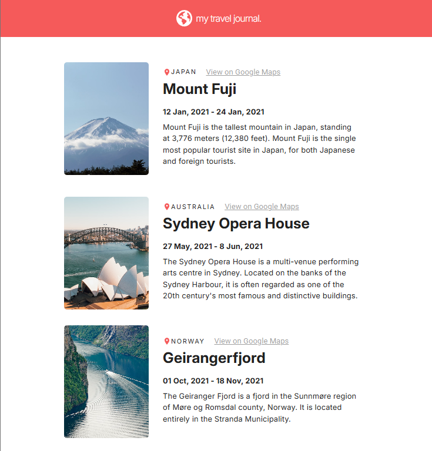

# 🌍 My Travel Journal

Uma aplicação web simples e responsiva para registrar viagens e explorar destinos de forma visual e interativa.



---

## 🚀 Tecnologias Utilizadas

- [React](https://reactjs.org/)
- [Vite](https://vitejs.dev/)
- [Material UI (MUI)](https://mui.com/)
- [JavaScript (ES6+)](https://developer.mozilla.org/en-US/docs/Web/JavaScript)
- [GitHub Pages](https://pages.github.com/) — para deploy

---

## ✨ Funcionalidades

- Exibição de entradas de viagem com imagem, local, data e descrição
- Layout responsivo com Material UI
- Facilidade para adicionar ou adaptar entradas
- Deploy simples via GitHub Pages

---

## 🎨 Layout (Figma)

Este projeto foi baseado no seguinte design:

👉 [Acessar layout no Figma](https://www.figma.com/design/QG4cOExkdbIbhSfWJhs2gs/Travel-Journal?node-id=0-1&t=3HJvJw3GueOZkzo1-1)

---

## 📦 Instalação

```bash
# Clone o repositório
git clone https://github.com/diegocarmn/travel-journal.git
cd travel-journal

# Instale as dependências
npm install

# Rode o projeto localmente
npm run dev
```
---

## 📝 Licença
Este projeto está sob a licença [MIT](LICENSE).

---

## 👤 Autor

Feito com 💙 por Diego Carmona

